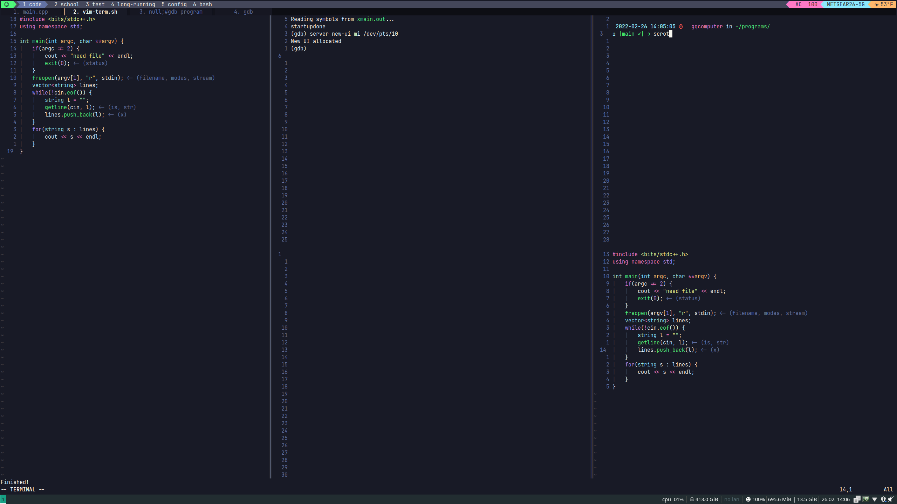

# Hi there 👋
I'm Geoffrey
## Skills
### Programming Languages: C/C++, Java, Python
### Tools: Git, Vim/Neovim, Linux, Google Sheets/Maps/Forms API, PyTorch, GDB
## Projects
[Meeting Scheduler](https://github.com/bloop132435/Spring2021Hackathon) 
A program that takes in your availability for all time slots through a Google Form, then optimizes which times to schedule meetings in 
[BWSI Embedded Security and Hardware Hacking](https://beaverworks.ll.mit.edu/CMS/bw/BWSI_Course_Embedded_Security_and_Hardware_Hacking) 
A course/project to build an encryption/decryption system in an embedded system (TI Tiva-C Launchpad) 
[Neovim config](https://github.com/bloop132435/config/tree/main/nvim) 
My config files for the text editor, Neovim 

<!--
**bloop132435/bloop132435** is a ✨ _special_ ✨ repository because its `README.md` (this file) appears on your GitHub profile.

Here are some ideas to get you started:

- 🔭 I’m currently working on ...
- 🌱 I’m currently learning ...
- 👯 I’m looking to collaborate on ...
- 🤔 I’m looking for help with ...
- 💬 Ask me about ...
- 📫 How to reach me: ...
- 😄 Pronouns: ...
- ⚡ Fun fact: ...
-->
